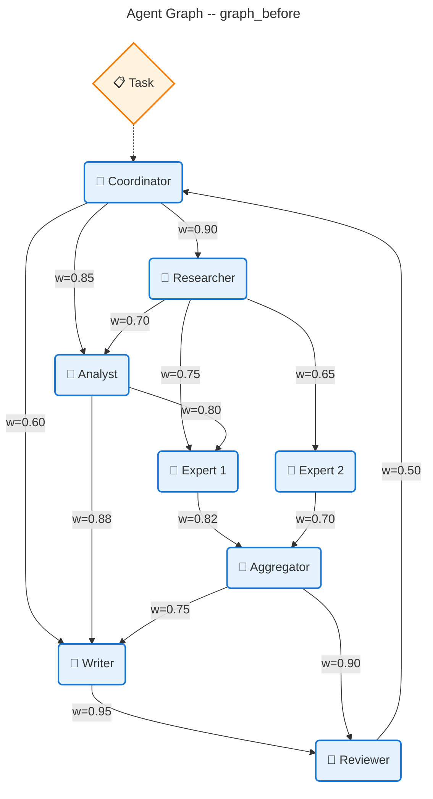

```mermaid
---
title: Agent Graph -- graph_before
---
flowchart TB
    task{📋 Task}
    coordinator(🤖 Coordinator)
    researcher(🤖 Researcher)
    analyst(🤖 Analyst)
    writer(🤖 Writer)
    reviewer(🤖 Reviewer)
    expert_1(🤖 Expert 1)
    expert_2(🤖 Expert 2)
    aggregator(🤖 Aggregator)

    task -.-> coordinator
    coordinator -->|w=0.90| researcher
    coordinator -->|w=0.60| writer
    coordinator -->|w=0.85| analyst
    researcher -->|w=0.65| expert_2
    researcher -->|w=0.75| expert_1
    researcher -->|w=0.70| analyst
    analyst -->|w=0.80| expert_1
    analyst -->|w=0.88| writer
    expert_1 -->|w=0.82| aggregator
    expert_2 -->|w=0.70| aggregator
    writer -->|w=0.95| reviewer
    aggregator -->|w=0.90| reviewer
    aggregator -->|w=0.75| writer
    reviewer -->|w=0.50| coordinator

    %% Styles
    classDef agent fill:#e3f2fd,stroke:#1976d2,stroke-width:2px
    class coordinator,researcher,analyst,writer,reviewer,expert_1,expert_2,aggregator agent
    classDef task fill:#fff3e0,stroke:#f57c00,stroke-width:2px
    class task task
```